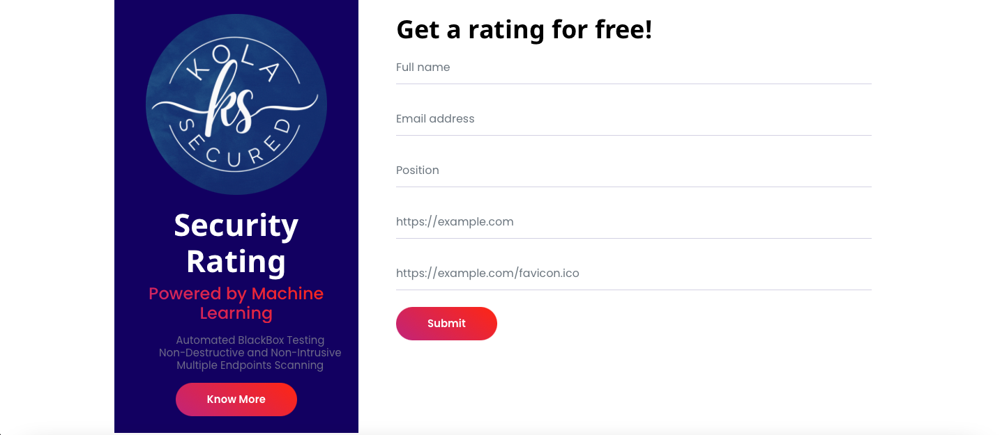
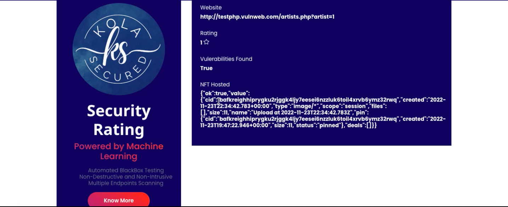

<h1 align="center">kolaSecured- Security Powered by ML and Blockchin</h1>

  <a href="#features">Features</a> |
  <a href="#installation">Installation</a> |
  <a href="#usage">Usage</a> 

</a>
# Features

- ML Model generates different test cases against endpoints of a website.
- Based on test cases a security rating is given (ranging from 1 to 5).
- Website's favicon and generated rating is used to create a NFT.
- NFT is hosted on IPFS (decentralized storage on blockchain).
- This NFT works as a proof of validation of the security rating.

# Installation
- First clone the repository or download the zip file:  
<code> git clone https://github.com/amanonearth/kolaSecured.git </code>
- Navigate to the directory and install all the requirements:  
<code> pip install -r REQUIREMENTS.txt </code>
- Go to web directory and run app.py: 
<code> python3 app.py </code>

# Usage
- To run the program, run app file: 
** <code> python3 app.py </code>  
- Visit Services page and enter the required fields.
</a>
- Result:

